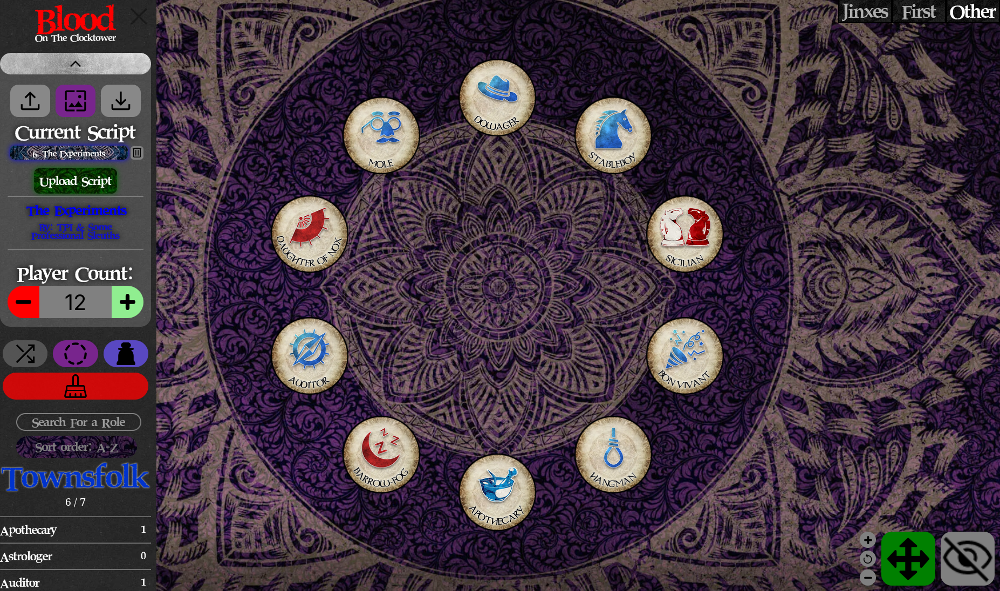

# CSH Grimoire v2


A digital implementation of the Grimoire, a tool used by Storytellers running the game [Blood on the Clocktower](https://bloodontheclocktower.com). 

You can find it online at [https://grimoire.cs.house](https://grimoire.cs.house).

This project was bootstrapped with [Create React App](https://github.com/facebook/create-react-app).

## Features

Many of the features are based around the official clocktower app, including
- Background images
- Character assets
- Scripts

But the app contains several improvements to allow users to run a game of clocktower with actual players in real time, including:

#### Arbitrary token and reminder placement


#### Night action cards to display to players


#### A "town square" mode to show publicly during the day


#### A bag mechanic to let characters be "chosen" by players


#### Custom script support, including...!


## Running as dev

In the project directory, you can run:

```
npm ci
npm start
```

To run the app in development mode. 
The webpage should open automatically. If it doesn't, go to [http://localhost:3000](http://localhost:3000) to view it in your browser.

The dev build will automatically refresh as changes are made.

## Deloying

A dockerfile is available for deployment. To build a deployment image, run:

```
docker build -t grimoire --target prod .
docker run -p 8080:8080 grimoire
```

Consult the docker file for more information. At deployment time, the grimoire will make a best-effort attempt to pull fresh assets from The Pandemonium Institute's [official repository](https://github.com/ThePandemoniumInstitute/botc-release) of character images. However, changes will not automatically be live. 

The project can then be viewed at [localhost](http://localhost:8080), port 8080. 
